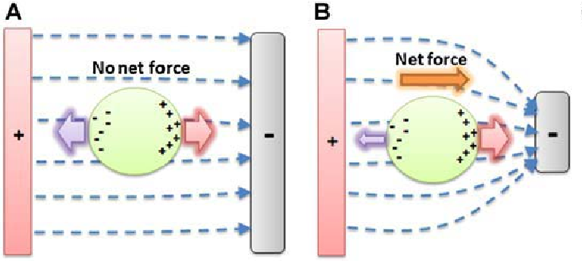

[![Contributors][contributors-shield]][contributors-url]
[![Forks][forks-shield]][forks-url]
[![Stargazers][stars-shield]][stars-url]
[![Issues][issues-shield]][issues-url]

<!-- PROJECT LOGO -->
 

  

<h3 align="center">Diagnosing Malaria with Dielectrophoresis</h3>

  

    Dielectrophoresis Simulation, written in Matlab. Made for the Computational Modeling of Electrical Systems class at ITESM.
     
    <a href="https://github.com/josecarlosmemo/malaria-dielectrophoresis"><strong>Explore the docs »</strong></a>
     
     
    <a href="https://youtu.be/urHszyBwzyw">View Demo</a>
    ·
    <a href="https://github.com/josecarlosmemo/malaria-dielectrophoresis/issues">Report Bug</a>
    ·
    <a href="https://github.com/josecarlosmemo/malaria-dielectrophoresis/issues">Request Feature</a>
  

<!-- TABLE OF CONTENTS -->

  
Table of Contents

  <ol>
    <li>
      <a href="#about-the-project">About The Project</a>
      <ul>
        <li><a href="#built-with">Built With</a></li>
      </ul>
    </li>
    <li><a href="#contributing">Contributing</a></li>
    <!-- <li><a href="#contact">Contact</a></li> -->

  </ol>

<!-- ABOUT THE PROJECT -->

## About The Project

[![Diagnosing Malaria with Dielectrophoresis Screen Shot][project_screenshot]](https://youtu.be/urHszyBwzyw)

Malaria is caused by small unicellular parasites that, at some point in their development, enter the red blood cells in the blood of the infected person. When an anopheles mosquito bites the sick person, it carries the parasites in the blood it has taken. If it then bites a second person, it transmits the disease. So to stop the spread of malaria, it is important to find out quickly who is sick, even before they show symptoms, to prevent them from being bitten by mosquitoes and spreading the disease. Unfortunately it can be very difficult for the physician to determine whether what the patient has is malaria or some other disease. That is why there is a lot of scientific research on techniques to diagnose it.
 
Dielectrophoresis is one of the methods for diagnosing malaria, using a sample of a person's blood. It is based on the fact that the electrical properties of red blood cells are different when they are healthy (healthy Red Blood Cell, hRBC) from when they are sick with malaria (infected Red Blood Cell, iRBC). So iRBCs can be recognized and separated from hRBCs because they move in a different way in a non-uniform electric field. When the red blood cell is between two electrodes that produce a uniform electric field, as seen below in Figure A, the electrostatic forces are opposite and equal on each side of the blood cell, and there is no net force. Conversely, if the electric field is not uniform, then on the globule there are different forces on each side, and a net force on the globule is obtained, as seen below in figure B:

(<a href="#top">back to top</a>)

### Built With

(<a href="#top">back to top</a>)

<!-- CONTRIBUTING -->

## Contributing

Contributions are what make the open source community such an amazing place to learn, inspire, and create. Any contributions you make are **greatly appreciated**.

If you have a suggestion that would make this better, please fork the repo and create a pull request. You can also simply open an issue with the tag "enhancement".
Don't forget to give the project a star! Thanks again!

1. Fork the Project
2. Create your Feature Branch (`git checkout -b feature/AmazingFeature`)
3. Commit your Changes (`git commit -m 'Add some AmazingFeature'`)
4. Push to the Branch (`git push origin feature/AmazingFeature`)
5. Open a Pull Request

(<a href="#top">back to top</a>)

[contributors-shield]: https://img.shields.io/github/contributors/josecarlosmemo/malaria-dielectrophoresis.svg?style=for-the-badge
[contributors-url]: https://github.com/josecarlosmemo/malaria-dielectrophoresis/graphs/contributors
[forks-shield]: https://img.shields.io/github/forks/josecarlosmemo/malaria-dielectrophoresis.svg?style=for-the-badge
[forks-url]: https://github.com/josecarlosmemo/malaria-dielectrophoresis/network/members
[stars-shield]: https://img.shields.io/github/stars/josecarlosmemo/malaria-dielectrophoresis.svg?style=for-the-badge
[stars-url]: https://github.com/josecarlosmemo/malaria-dielectrophoresis/stargazers
[issues-shield]: https://img.shields.io/github/issues/josecarlosmemo/malaria-dielectrophoresis.svg?style=for-the-badge
[issues-url]: https://github.com/josecarlosmemo/malaria-dielectrophoresis/issues
[project_screenshot]: https://img.youtube.com/vi/urHszyBwzyw/0.jpg
